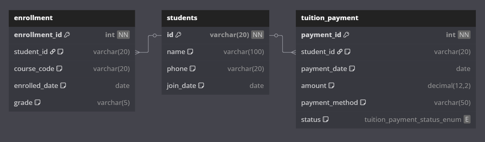
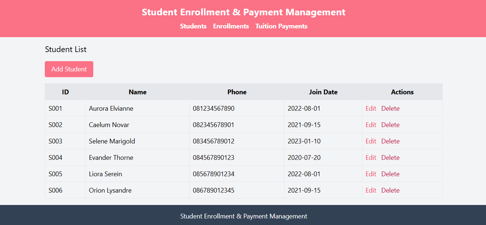

# Janji
Saya Yusrilia Hidayanti dengan NIM 2306828 mengerjakan Tugas Praktikum 10 dalam mata kuliah Desain dan Pemrograman Berorientasi Objek untuk keberkahanNya maka saya tidak melakukan kecurangan seperti yang telah dispesifikasikan. Aamiin.

# Desain Program

Desain Database:

Desain program menggunakan pola MVVM (Model-View-ViewModel) yang terdiri dari tiga komponen utama:

- **Model**: Berisi kelas PHP yang berinteraksi langsung dengan database (Student, Enrollment, TuitionPayment). Setiap model menyediakan fungsi CRUD (Create, Read, Update, Delete) untuk tabel terkait.
- **ViewModel**: Menjembatani antara model dan view. ViewModel memanggil fungsi pada model dan menyiapkan data yang akan ditampilkan pada view. Setiap entitas memiliki ViewModel sendiri (StudentViewModel, EnrollmentViewModel, TuitionPaymentViewModel).
- **View**: Berisi file PHP yang menampilkan data ke user dalam bentuk HTML dan TailwindCSS. View menerima data dari ViewModel dan menyediakan form untuk input/update data.

Struktur folder `Project/`:
- `model/` : Kelas model database
- `viewmodel/` : Kelas ViewModel
- `views/` : Halaman tampilan dan template (header/footer)
- `config/database.php` : Koneksi database
- `index.php` : Routing utama aplikasi

# Penjelasan Alur

1. **User membuka halaman** dan memilih menu (Students, Enrollments, Tuition Payments) pada navigasi.
2. **index.php** membaca parameter `entity` dan `action` dari URL, lalu memanggil ViewModel yang sesuai.
3. **ViewModel** mengambil data dari Model (misal: daftar mahasiswa dari Student.php) dan mengirimkannya ke View.
4. **View** menampilkan data dalam tabel/list atau form input. Jika user mengisi form dan submit, data dikirim ke index.php dengan action `save` atau `update`.
5. **index.php** memanggil fungsi ViewModel untuk menambah/mengubah/menghapus data di database melalui Model.
6. Setelah aksi berhasil, user diarahkan kembali ke halaman list.

Setiap entitas (mahasiswa, enrollment, pembayaran) memiliki alur serupa, sehingga aplikasi konsisten dan mudah dikembangkan.

# Dokumentasi
